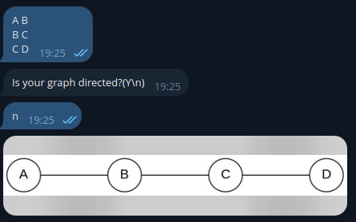
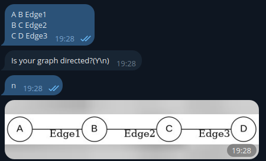
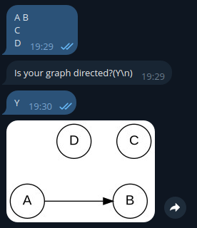

# Graph Visualizer Telegram Bot

## **Project Description💡**

This Telegram bot simplifies graph visualization for users, particularly in competitive programming contexts. 
It empowers users to seamlessly convert textual graph representations into clear and aesthetically pleasing visualizations.

## **Key Features⚙️**

* Effortless Graph Input: Users submit a list of edges (and optional labels) representing their graph structure.
* Customizable Output: The bot generates an image of the graph, employing the Graphviz library to render the visuals.
* Directed/Undirected Support: Handles both directed and undirected graphs.
* Intuitive Interaction: Guides users through the visualization process with clear commands and prompts.

## **Install**

1. Install Graphviz: Ensure Graphviz is installed on your system and PATH variable is set(https://graphviz.org/download/).
2. Clone repository from GitHub. 
3. Set Environment Variables: Create a .env file in your project's root directory and add this line, replacing the placeholder with your bot token:
    ```dotenv
    TELOXIDE_TOKEN=YOUR_TOKEN
    RUST_LOG=LOG_LEVEL
    ```
4. Run the Bot: Execute the following command in your terminal:
    ```bash
    cargo run
    ```
## **How to use**
1. Send a list of vertices in the following format:
   ```
   A B
   B C
   C D
   ```
   

   Each line represents an edge connecting two vertices. Vertices are separated by a space.
2. Optionally, you can add a third parameter as the label for the edge:
   ```
   A B Edge1
   B C Edge2
   C D Edge3
   ```
   

3. Also, you can add just nodes in a single line:
   ```
   A B
   C
   D
   ```
   

4. The bot will convert the graph into a PNG image and send it back to you.
5. Enjoy!

## Have an idea or bug report?

I would be glad to see them in issues and discussions.
